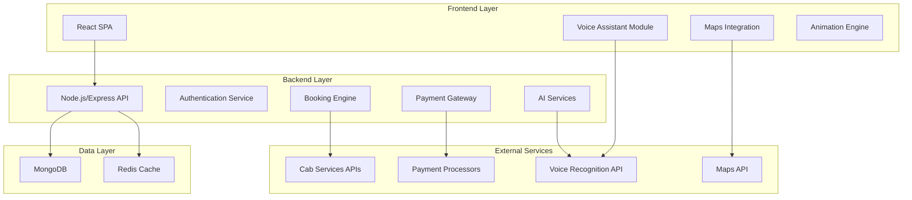

# Design Document

## Overview

The Enhanced Railway Booking Platform is a modern, full-stack web application built with React frontend and Node.js backend. The platform extends traditional railway booking with AI-powered features, integrated services, and gamification elements. The system prioritizes accessibility, user experience, and seamless integration of multiple transportation and hospitality services.

## Architecture

### High-Level Architecture



### Technology Stack

**Frontend:**
- React 18 with functional components and hooks
- CSS3 with animations and transitions
- Web Speech API for voice recognition
- Axios for API communication
- React Router for navigation

**Backend:**
- Node.js with Express.js framework
- JWT for authentication
- bcrypt for password hashing
- Mongoose for MongoDB interaction
- Redis for session management and caching

**Database:**
- MongoDB for primary data storage
- Redis for caching and session storage

**External Integrations:**
- Google Maps API for navigation
- Uber/Ola APIs for cab booking
- Payment gateway APIs (Razorpay/Stripe)
- Web Speech API for voice recognition

## Components and Interfaces

### Frontend Components

#### Core Components
1. **App Component**
   - Main application wrapper
   - Route management
   - Global state management

2. **Authentication Components**
   - LoginForm with train animation loading
   - RegisterForm
   - ProtectedRoute wrapper

3. **Booking Components**
   - BookTicket (dedicated page)
   - TrainSearch
   - SeatSelection
   - PassengerDetails
   - PriceCalculator

4. **Feature Components**
   - VoiceAssistant
   - SeatFinder
   - CabBooking
   - PorterService
   - FoodOrdering
   - CleanlinessTracker

5. **User Interface Components**
   - UserProfile
   - Dashboard
   - UpcomingJourneys
   - RewardPoints

6. **Payment Components**
   - PaymentPortal
   - CardPayment
   - UPIPayment (under development)

#### Component Structure
```
src/
├── components/
│   ├── common/
│   │   ├── Header.js
│   │   ├── Footer.js
│   │   ├── LoadingTrain.js
│   │   └── AnimatedButton.js
│   ├── auth/
│   │   ├── LoginForm.js
│   │   └── RegisterForm.js
│   ├── booking/
│   │   ├── BookTicket.js
│   │   ├── TrainSearch.js
│   │   └── SeatSelection.js
│   ├── features/
│   │   ├── VoiceAssistant.js
│   │   ├── SeatFinder.js
│   │   ├── CabBooking.js
│   │   ├── PorterService.js
│   │   ├── FoodOrdering.js
│   │   └── CleanlinessTracker.js
│   └── user/
│       ├── UserProfile.js
│       └── Dashboard.js
├── pages/
│   ├── Home.js
│   ├── BookTicketPage.js
│   ├── PaymentPortal.js
│   └── UserDashboard.js
├── services/
│   ├── api.js
│   ├── voiceService.js
│   └── mapService.js
└── utils/
    ├── priceCalculator.js
    └── animations.js
```

### Backend API Structure

#### Core API Endpoints

**Authentication:**
- POST /api/auth/register
- POST /api/auth/login
- GET /api/auth/profile
- PUT /api/auth/profile

**Booking:**
- GET /api/trains/search
- POST /api/bookings/create
- GET /api/bookings/user/:userId
- GET /api/bookings/:bookingId

**Features:**
- POST /api/voice/process
- GET /api/maps/navigation
- POST /api/cab/book
- GET /api/porter/available
- GET /api/food/menu
- POST /api/cleanliness/verify

**Payment:**
- POST /api/payment/initiate
- POST /api/payment/verify
- GET /api/payment/status/:paymentId

#### API Response Format
```json
{
  "success": true,
  "data": {},
  "message": "Operation successful",
  "timestamp": "2024-01-01T00:00:00Z"
}
```

## Data Models

### User Model
```javascript
{
  _id: ObjectId,
  name: String,
  email: String,
  phone: String,
  password: String (hashed),
  rewardPoints: Number,
  upcomingJourneys: [ObjectId],
  createdAt: Date,
  updatedAt: Date
}
```

### Booking Model
```javascript
{
  _id: ObjectId,
  userId: ObjectId,
  trainNumber: String,
  trainName: String,
  from: String,
  to: String,
  journeyDate: Date,
  passengers: [{
    name: String,
    age: Number,
    gender: String
  }],
  class: String,
  seatNumbers: [String],
  totalPrice: Number,
  status: String,
  bookingDate: Date,
  pnr: String
}
```

### Train Model
```javascript
{
  _id: ObjectId,
  trainNumber: String,
  trainName: String,
  route: [{
    station: String,
    arrivalTime: String,
    departureTime: String,
    distance: Number
  }],
  classes: [{
    type: String,
    basePrice: Number,
    availability: Number
  }]
}
```

### Additional Models
- Porter Model (for verified porter services)
- Food Model (for train kitchen hub)
- Cab Booking Model (for integrated cab services)
- Cleanliness Record Model (for reward system)

## Error Handling

### Frontend Error Handling
1. **API Error Interceptors**
   - Axios interceptors for global error handling
   - User-friendly error messages
   - Automatic retry for network failures

2. **Component Error Boundaries**
   - React Error Boundaries for component crashes
   - Fallback UI components
   - Error reporting to backend

3. **Form Validation**
   - Real-time input validation
   - Clear error messaging
   - Accessibility-compliant error states

### Backend Error Handling
1. **Global Error Middleware**
   - Centralized error processing
   - Consistent error response format
   - Error logging and monitoring

2. **Validation Errors**
   - Input validation using Joi or similar
   - Detailed validation error messages
   - Security-focused validation

3. **Database Errors**
   - MongoDB connection error handling
   - Transaction rollback mechanisms
   - Data consistency checks

## Testing Strategy

### Frontend Testing
1. **Unit Testing**
   - Jest for component testing
   - React Testing Library for DOM testing
   - Mock external API calls

2. **Integration Testing**
   - End-to-end user flows
   - API integration testing
   - Voice assistant functionality testing

3. **Accessibility Testing**
   - Screen reader compatibility
   - Keyboard navigation testing
   - Color contrast validation

### Backend Testing
1. **Unit Testing**
   - Jest for business logic testing
   - Database operation testing
   - Authentication flow testing

2. **API Testing**
   - Supertest for endpoint testing
   - Authentication middleware testing
   - Error handling validation

3. **Integration Testing**
   - Database integration testing
   - External API integration testing
   - Payment gateway testing

## Security Considerations

### Authentication & Authorization
- JWT tokens with appropriate expiration
- Password hashing with bcrypt
- Role-based access control
- Session management with Redis

### Data Protection
- Input sanitization and validation
- SQL injection prevention
- XSS protection
- CORS configuration

### Payment Security
- PCI DSS compliance considerations
- Secure payment token handling
- Encrypted data transmission
- Payment gateway integration security

## Performance Optimization

### Frontend Optimization
- Code splitting with React.lazy
- Image optimization and lazy loading
- Caching strategies for API responses
- Animation performance optimization

### Backend Optimization
- Database indexing strategy
- Redis caching for frequent queries
- API response compression
- Connection pooling

### Scalability Considerations
- Horizontal scaling architecture
- Load balancing strategies
- Database sharding considerations
- CDN integration for static assets

## User Experience Design

### Visual Design
- Modern, clean interface with engaging colors
- Consistent design system and components
- Responsive design for all screen sizes
- Accessibility-first design approach

### Animation Strategy
- Smooth transitions between states
- Loading animations (train animation for auth)
- Micro-interactions for user feedback
- Performance-optimized animations

### Voice Interface Design
- Multi-language support architecture
- Natural language processing integration
- Voice feedback and confirmation system
- Timeout-free interaction design

### Navigation Design
- Intuitive information architecture
- Clear call-to-action buttons
- Breadcrumb navigation
- Mobile-first navigation patterns